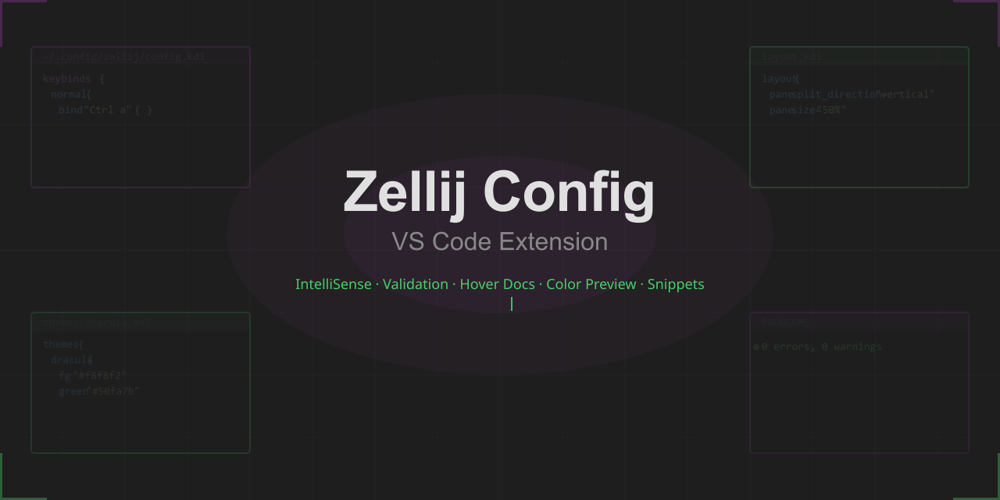

<p align="center">
  
</p>

<p align="center">
  <strong>Complete Zellij development toolkit: IntelliSense, validation, color preview, and snippets for config and layout files.</strong>
</p>

<p align="center">
  <a href="https://marketplace.visualstudio.com/items?itemName=andreahlert.zellij-vscode-toolkit">
    
  </a>
  <a href="https://marketplace.visualstudio.com/items?itemName=andreahlert.zellij-vscode-toolkit">
    
  </a>
  <a href="https://github.com/andreahlert/zellij-vscode-toolkit/blob/main/LICENSE">
    
  </a>
  
  
</p>

<p align="center">
  The first dedicated VS Code extension for Zellij. No more trial-and-error config editing.
</p>

<br>

## Features

### Config Completions

> Smart completions for all 26+ config options with type hints, default values, and documentation.

<p align="center">
  
</p>

### Keybind & Action Completions

> Context-aware completions inside keybind blocks. Suggests modes, bind syntax, and all 53+ actions with parameter hints.

<p align="center">
  
</p>

### Hover Documentation

> Hover over any option, action, or mode to see description, valid values, examples, and links to Zellij docs.

<p align="center">
  
</p>

### Diagnostics & Validation

> Catch errors before launching Zellij. Validates option names, value types, mode names, action names, SwitchToMode targets, and hex colors.

<p align="center">
  
</p>

### Theme Color Preview

> Inline color decorators for hex values in theme definitions, with VS Code's native color picker.

<p align="center">
  
</p>

### What's Covered

| Area | Count | Details |
|------|-------|---------|
| Config options | 26+ | All documented options with types and defaults |
| Actions | 53+ | Full action set with parameters |
| Modes | 14 | All keybind modes including shared/tmux |
| Layout elements | 12 | Pane, tab, templates, swap layouts |
| Built-in plugins | 9 | tab-bar, status-bar, strider, etc. |
| Theme colors | 11 | fg, bg, and all ANSI colors |

### Snippets

| Prefix | Description |
|--------|-------------|
| `zellij-config` | Full config template |
| `zellij-keybinds` | Keybinding block |
| `zellij-theme` | Theme definition |
| `zellij-layout` | Basic layout |
| `zellij-layout-split` | Split pane layout |
| `zellij-layout-tabs` | Multi-tab layout |
| `zellij-plugin` | Plugin configuration |
| `zellij-bind` | Single key binding |
| `zellij-swap` | Swap layout definition |
| `zellij-shared` | Shared keybindings |

<br>

## Installation

**VS Code Marketplace:**

1. Open VS Code
2. Press `Ctrl+Shift+X` (or `Cmd+Shift+X`)
3. Search for **"Zellij Config"**
4. Click **Install**

**Command Line:**

```bash
code --install-extension andreahlert.zellij-vscode-toolkit
```

<br>

## File Detection

The extension activates for:
- Files named `config.kdl` (auto-detected as Zellij config)
- Files in `~/.config/zellij/` directory
- Any `.kdl` file manually set to "Zellij Config" language
- Use command **"Zellij: Set as Zellij Config"** to manually activate

<br>

## Configuration

| Setting | Default | Description |
|---------|---------|-------------|
| `zellijConfig.zellijBinaryPath` | `"zellij"` | Path to Zellij binary |
| `zellijConfig.enableValidation` | `true` | Enable real-time validation |
| `zellijConfig.enableColorDecorators` | `true` | Show inline color decorators |

<br>

## Why This Extension?

Zellij has **30K+ GitHub stars** and growing fast, but its KDL config format has zero dedicated editor support. Generic KDL extensions only provide syntax highlighting. This extension adds:

- Context-aware completions (different suggestions in keybinds vs themes vs layouts)
- Real validation that catches errors before runtime
- The only tool that knows about Zellij's 53 actions and their parameters
- Color preview for theme editing

<br>

## Contributing

```bash
git clone https://github.com/andreahlert/zellij-vscode-toolkit.git
cd zellij-config-vscode
npm install
npm run build
npm run test:e2e
# Press F5 in VS Code to debug
```

<br>

## License

[MIT](LICENSE)

---

<p align="center">
  <sub>Built for the Zellij community</sub>
</p>
